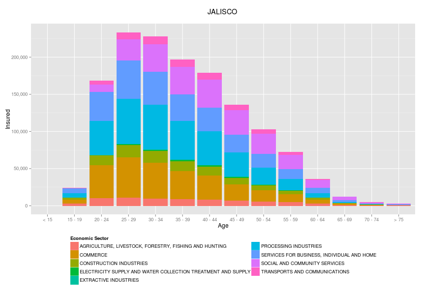

## Background

The *Mexican Social Security Institute* (IMSS) has been publishing interesting data that was previously not public. This is attributed to the new tendency that incites governments to be more transparent.

But data alone is not that meaningful for most people. The retrieval and interpretation of these new datasets remains esoteric. Only very few persons are able to truly interpret the millions of records out there. 

There is a transparency, but it is obscured by the restrictions inherent to the data storge/retrieval techonologies.

--- 

## Solution

This is where this project comes in:
I want the people to understand what the government is doing. I want for the information to be useful to us so that it becomes easier for the mexicans to draw educated conclusions.

The project consists of a series of graphics based on datasets issued by the *Mexican Social Security Institute*. This first instance will depict the number of insured persons with the person's age group, profession's economic sector and state of residence as covariates.

Can we  see a trend in the equality of sexes with regards to number of males/females insured?
Which states have the most insured under and overaged persons?
What is the economic sector with most insured people?

All of this questions can be easily answered by glancing at graphs rather than by going through the labor-intense path of processing the data.

--- &twocol

## Examples

Here's an example of the graphics I'm aiming to provide:

*** =left

<!--  -->
A descriptive graph of the number of insured people by sex working on a certain sector on a certain state.

*** =right

<!--  -->
A descriptive graph of the number of insured people by sector on a certain state.

---

## Summary

The project aims to make public information open to interpretation by anyone without having specifc knowledge of the underlying data structure.

* It is purely descriptive (at least the first phase of it).
* The demo of the first application is hosted in the shinyapps server <a href="https://mistirrin.shinyapps.io/IMSS">here</a>.
* I use data publicly available from <a href ="http://busca.datos.gob.mx/#/conjuntos/asegurados-en-el-imss">here</a>.

Any feedback would be greatly appreciated.

Thanks!
